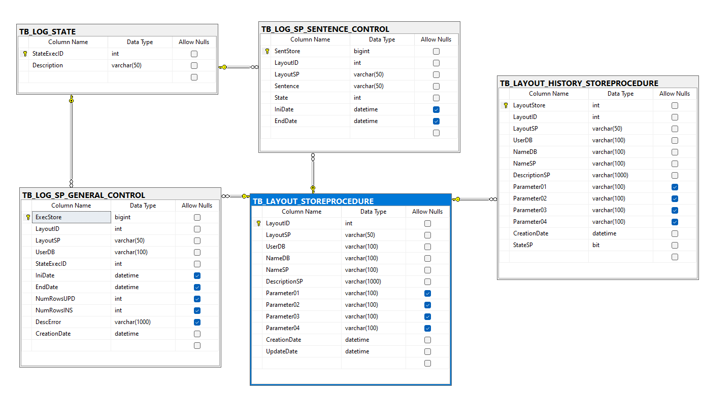
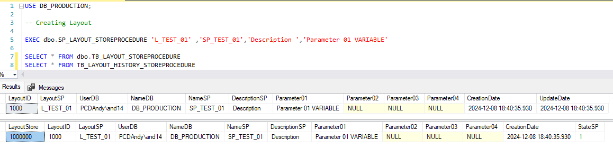
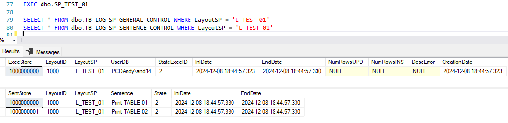
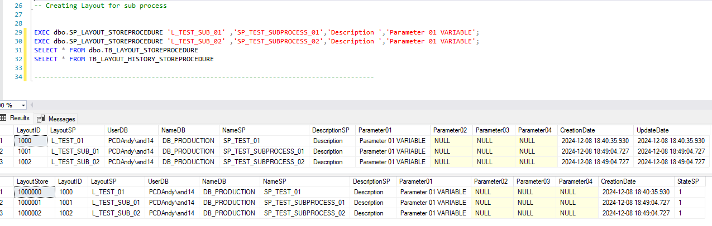
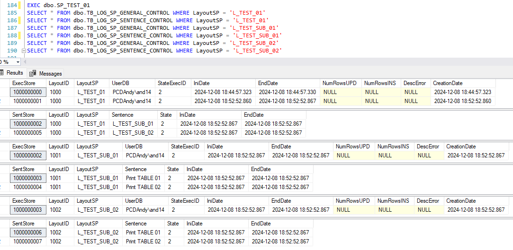

# Script SQL Server Control Log Exec Stored Procedure


## Model Physical




## Execution Steps 

### Step 00
Optional:

```sql
CREATE DATABASE DB_PRODUCTION
```
File: [`00_creation_database_Optional.sql`](v1.0/00_creation_database_Optional.sql)


### Step 01 - Create Tables


```sql
CREATE TABLE dbo.TB_LAYOUT_STOREPROCEDURE ...
CREATE TABLE dbo.TB_LAYOUT_HISTORY_STOREPROCEDURE ...
CREATE TABLE dbo.TB_LOG_STATE ...
CREATE TABLE dbo.TB_LOG_SP_GENERAL_CONTROL ...
CREATE TABLE dbo.TB_LOG_SP_SENTENCE_CONTROL ...
```
File: [`01_creation_tables.sql`](v1.0/01_creation_tables.sql)

### Step 02 - Create SP Register Layout

```sql
CREATE PROCEDURE dbo.SP_LAYOUT_STOREPROCEDURE ...
```
File: [`02_creation_SP_Layout.sql`](v1.0/02_creation_SP_Layout.sql)

### Step 03 - Create SP Log Execution Stored Procedure

```sql
CREATE PROCEDURE dbo.SP_LOG_STOREPROCEDURE ...
```
File: [`03_creation_SP_Control_General.sql`](v1.0/03_creation_SP_Control_General.sql)

### Step 04 - Create SP Log Execution of sentece Stored Procedure 

```sql
CREATE PROCEDURE dbo.SP_LOG_STOREPROCEDURE_SENTENCE ...
```
File: [`04_creation_SP_Control_Sentence.sql`](v1.0/04_creation_SP_Control_Sentence.sql)

### Step 05 - Insert Seed Rows status Control

```sql
INSERT INTO dbo.TB_LOG_STATE VALUES ('Insert new Log General');
INSERT INTO dbo.TB_LOG_STATE VALUES ('Update Log General Successful');
INSERT INTO dbo.TB_LOG_STATE VALUES ('Update Log General Error');

```
File: [`05_creation_Seed.sql`](v1.0/05_creation_Seed.sql)


## Example 01: Running an SP


### Step 01 - Create Layout

The "L_TEST_01" is Layout of Stored procedure
```sql
-- Creating Layout

EXEC dbo.SP_LAYOUT_STOREPROCEDURE 'L_TEST_01' ,'SP_TEST_01','Description ','Parameter 01 VARIABLE'

SELECT * FROM dbo.TB_LAYOUT_STOREPROCEDURE
SELECT * FROM TB_LAYOUT_HISTORY_STOREPROCEDURE

```
File: [`97_Example_Creation_Layout.sql`](v1.0/97_Example_Creation_Layout.sql)


### Step 02 - Create SP

```sql
CREATE PROCEDURE dbo.SP_TEST_01 ...
```
File: [`98_Example_Creation_SP.sql`](v1.0/98_Example_Creation_SP.sql)

### Step 03 - Execution SP

```sql
EXEC dbo.SP_TEST_01

SELECT * FROM dbo.TB_LOG_SP_GENERAL_CONTROL WHERE LayoutSP = 'L_TEST_01' -- layout
SELECT * FROM dbo.TB_LOG_SP_SENTENCE_CONTROL WHERE LayoutSP = 'L_TEST_01' -- layout
```



## Example 02: Run an SP that runs multiple SPs


### Step 01 - Create Layout

The "L_TEST_01" is Layout of Stored procedure
```sql
-- Creating Layout

EXEC dbo.SP_LAYOUT_STOREPROCEDURE 'L_TEST_01' ,'SP_TEST_01','Description ','Parameter 01 VARIABLE' ;
EXEC dbo.SP_LAYOUT_STOREPROCEDURE 'L_TEST_SUB_01' ,'SP_TEST_SUBPROCESS_01','Description ','Parameter 01 VARIABLE';
EXEC dbo.SP_LAYOUT_STOREPROCEDURE 'L_TEST_SUB_02' ,'SP_TEST_SUBPROCESS_02','Description ','Parameter 01 VARIABLE';


SELECT * FROM dbo.TB_LAYOUT_STOREPROCEDURE
SELECT * FROM TB_LAYOUT_HISTORY_STOREPROCEDURE

```
File: [`97_Example_Creation_Layout.sql`](v1.0/97_Example_Creation_Layout.sql)


### Step 02 - Create SPs
In the main process, yes, use TRY and CACTH.
In the subProcess, do not use TRY and CATCH.

```sql
CREATE PROCEDURE dbo.SP_TEST_SUBPROCESS_01
CREATE PROCEDURE dbo.SP_TEST_SUBPROCESS_02
CREATE PROCEDURE dbo.SP_TEST_01 ...
```
File: [`99_Example_Creation_SP_Multiple.sql`](v1.0/99_Example_Creation_SP_Multiple.sql)

### Step 03 - Execution SP

```sql
EXEC dbo.SP_TEST_01
SELECT * FROM dbo.TB_LOG_SP_GENERAL_CONTROL WHERE LayoutSP = 'L_TEST_01'
SELECT * FROM dbo.TB_LOG_SP_SENTENCE_CONTROL WHERE LayoutSP = 'L_TEST_01'
SELECT * FROM dbo.TB_LOG_SP_GENERAL_CONTROL WHERE LayoutSP = 'L_TEST_SUB_01'
SELECT * FROM dbo.TB_LOG_SP_SENTENCE_CONTROL WHERE LayoutSP = 'L_TEST_SUB_01'
SELECT * FROM dbo.TB_LOG_SP_GENERAL_CONTROL WHERE LayoutSP = 'L_TEST_SUB_02'
SELECT * FROM dbo.TB_LOG_SP_SENTENCE_CONTROL WHERE LayoutSP = 'L_TEST_SUB_02'
```
